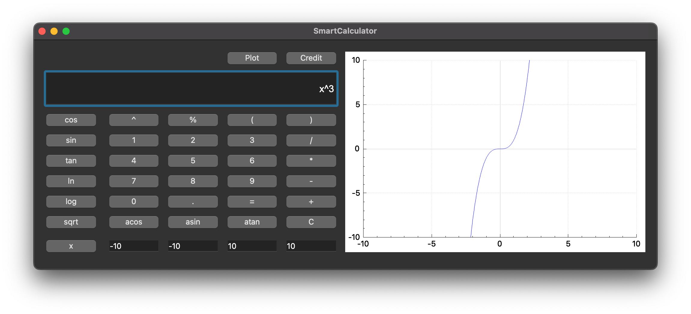

## **SmartCalculator C++**
#### Educational project from School 21 by Sber;

* You can calculate any arithmetic problem, including complex examples with nested brackets. To do this, **enter an example and click the button with the equal sign (=)**;
* **if the answer is inf**, it means you entered the problem incorrectly;
* to **plot a graph**, enter your equation, enter the range of acceptable values for X and Y and click on the graph button;
* there is also a loan (credit) calculator, but this is an experimental feature.
